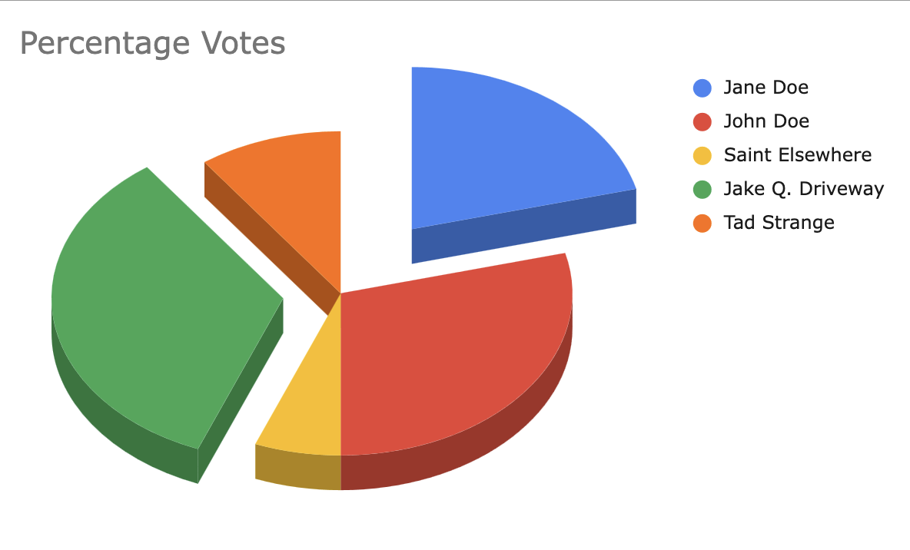
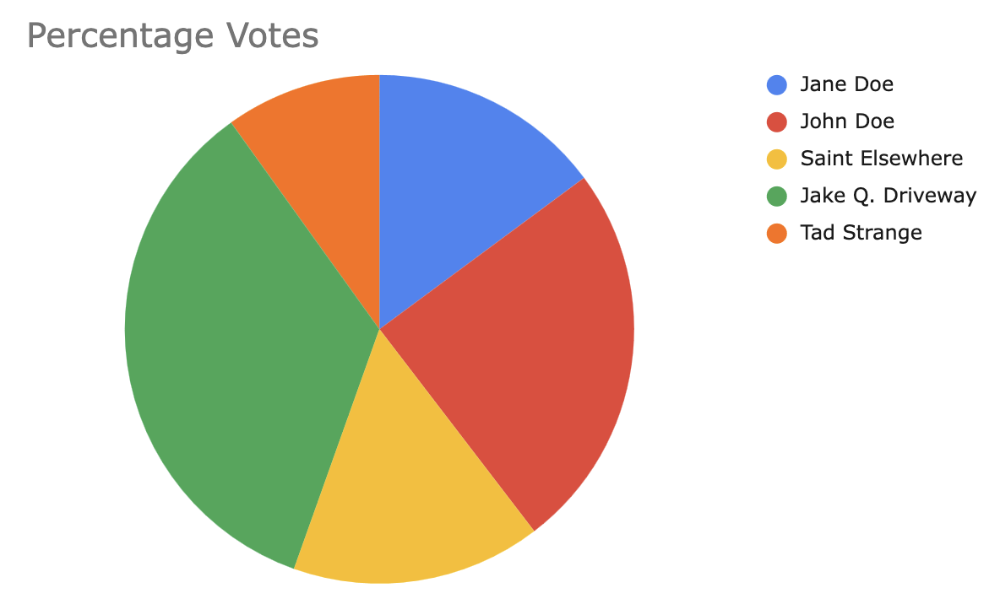
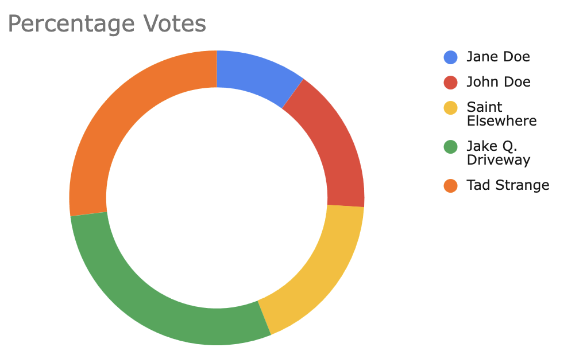

# Basic Project Overview

As requested, we created an interactive, web-based data online experiment, in our case based in ReVISit. 

The experiment is hosted on gh-pages, right over here:
https://aekratman.github.io/retry_dv3/basic-questionnaire-study

This experiment focuses on a fictional town election and has participants compare the percentage won by two candidates, __Jake Driveway__ and __Jane Doe.__

These candidates' election results are compared through a pie chart, visualized three different ways, pictured below. 

Our overall question concerned: _How does orientation affect how users interpret data from a pie chart?_ Our hypothesis considered that most likely, users would have an easier time reading 3D implementations due to a clearer viewpoint of comparison.

Please see the following section in explanation for the data analysis. 

# General Description of Data Analysis
(See full data in file labelled Assignment_3_Data_Analysis.pdf)
1. We began by calling the downloaded JSON into R. We then checked to make sure it included all the necessary information using the __glimpse__ function, which was commented out (given the size of the JSON).

2. The data was then converted to a CSV for easier analysis, in which only the participant's name and their responses to the three questions were included. The __jsonlite__ library was used to do this.

3. Once the data was converted, it was cleaned for ease of use. A clear example of this cleaning: one participant used decimals, so their responses were converted to percents. Some participants did not round up, so those answers were converted, and all testing runs were removed from the data. Both the new cleaned data and the original raw data were saved. In this step, the participants names were also changed to P1-P29 as to perceive anonymity in the data in case the final data set is ever shared.

4. Once the data was cleaned, analysis could begin, which started with setting the true value-- twenty for each chart.

5.  First absolute error was conducted and plotted using the __abs()__ function and ggplot. These errors were quite large, likely being dragged by extreme outliers in the data. The error bars shown within the graphs are very large and do not give good indication of precise error, showing abs error might not always be reliable

6. A custom function in R was then created, modeled after the Cleveland and McGill logarithmic scale for error. It was created by copying the function defined and using function() with cm_error as the final function name. These errors had a lot less variability within the graphs, but still had clear indication that the hole graph was the worst performing. As seen in the ggplot there is more overlap within the error bars and they are much more condensed, meaning the outliers are not dragging the error.

This analysis overall proved that the hole graph was the worst performing graph, with base and 3d being very similar. The ggplots showed overlapping error between the three charts, indicating none of the charts had differences that were statistically significant. In order to prove this we ran an ANOVA test along with Tukey HSD to determine if any of the charts were significantly different. The p-values for all of these charts were large so there was no statistically significant data found. This analysis also showed the use of Cleveland and Mcgill’s work as outliers extremely overinflate results in abs error.

# Design Achievement:
In order to satisfy the design achievement, we included the following factors within our experiment and analysis. 
- First we presented all of our findings with an R markdown file. This makes it easier for people to read and understand what we found. 
- We also included an additional graph that showed the best chart in a left to right sequence, better indicating which charts had the most error. 
- On this additional graph, we also included the Cleveland and McGill baseline indicated for pie charts in their study. This line takes their past work into account and the line is created using their 2.63 baseline for pie charts. From this line we were able to make conclusions about how our results differed from theirs. This line showed that our participants struggled more with our pie charts, meaning they were more difficult than previous studies. 
- Finally, we used colorblind friendly colors to make our graphs better interpretable for all readers.

# Technical Achievement: 
To satisfy the technical achievement we used R, which was briefly used in previous assignments for this class. Within R we hand replicated the Cleveland & McGill log-base-2 error formula. We also used a more advanced function mean_cl_boot rather than simple standard error for better accuracy when calculating the 95% confidence intervals. We converted the JSON to CSV and cleaned it showing best data analysis practices. To further analysis our data we conducted an ANOVA, this was to determine if there were any significant differences between the charts. Though none were found we demonstrated we know how to find significance in data. As other technical achievements, we implemented our experiment in ReVISit rather than using JS or another software; we also created our original graphs in Excel, to pull from the technical skills learned in assignment 2.